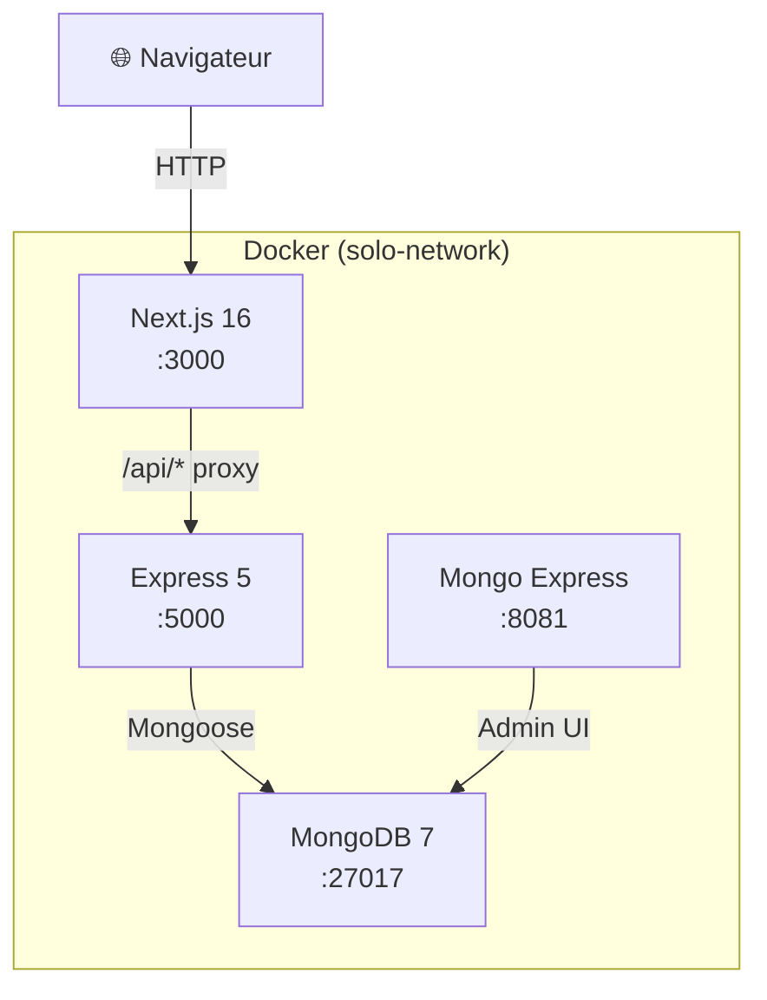

# Architecture — SoloWithPeace

## Vue d'ensemble

SoloWithPeace est une application web de mise en relation de voyageurs solo. Elle suit une architecture client-serveur classique avec une API REST.

## Diagramme des composants



## Stack technique

| Couche | Technologie | Version |
|---|---|---|
| Frontend | Next.js + React | 16 / 19 |
| Styling | Tailwind CSS | 4 |
| Backend | Node.js + Express | 20 / 5 |
| Base de données | MongoDB | 7 |
| ODM | Mongoose | 8 |
| Auth | JWT (jsonwebtoken) | 9 |
| Conteneurisation | Docker + Compose | — |

## Ports

| Service | Port | Accès |
|---|---|---|
| Frontend (Next.js) | 3000 | Public |
| Backend (API) | 5000 | Via proxy Next.js |
| MongoDB | 27017 | Interne Docker |
| Mongo Express | 8081 | Dev uniquement |

## Flux d'authentification

```
Client → POST /api/auth/login
       ← JWT token (7 jours)

Client → GET /api/trips (Authorization: Bearer <token>)
       ← données protégées
```

## Structure des dossiers

```
solowithpeace/
├── backend/
│   ├── db/           # Connexion MongoDB + seed
│   ├── models/       # Schémas Mongoose
│   ├── routes/       # Handlers Express
│   └── index.js      # Point d'entrée
├── frontend/
│   ├── app/          # Pages Next.js (App Router)
│   └── context/      # AuthContext React
├── docs/             # Documentation technique
└── docker-compose.yml
```