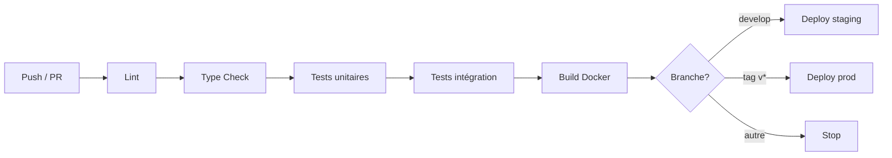

# SoloWithPeace — Plateforme de mise en relation pour voyageurs solos

## Sommaire

1. [Équipe & répartition](#équipe--répartition)
2. [Architecture technique](#architecture-technique)
3. [Stack technologique](#stack-technologique)
4. [Démarrage rapide](#démarrage-rapide)
5. [Workflow Git](#workflow-git)
6. [Pipeline CI/CD](#pipeline-cicd)
7. [Migrations base de données](#migrations-base-de-données)
8. [Tests](#tests)
9. [Monitoring & observabilité](#monitoring--observabilité)
10. [Déploiement](#déploiement)
11. [Documentation](#documentation)

---

## Équipe & répartition

| Membre | Rôle principal | Responsabilités DevOps |
|---|---|---|
| **Jordan Jimenez** | Chef de projet / PO / Front-End | Git workflow, conventions de commits, documentation, tests E2E Playwright, présentation |
| **Branis Kaci** | Back-End / Sécurité | Pipeline CI/CD, Docker backend, migrations DB, Prometheus, alerting, SLO |
| **Clément Bardin** | Front-End / UX Design | Docker frontend, tests unitaires front, feature flags, dashboards Grafana, audits Lighthouse |

Chaque membre doit pouvoir expliquer l'intégralité de la chaîne DevOps lors de la soutenance.

## Stack technologique

| Couche | Technologie | Version |
|---|---|---|
| Frontend | Next.js + TypeScript + Tailwind CSS | 14.x / 5.x / 3.x |
| Backend | Node.js + Express + TypeScript | 20 LTS / 4.x / 5.x |
| Temps réel | Socket.IO | 4.x |
| Base de données | MongoDB + Mongoose | 7.x / 8.x |
| Migrations | migrate-mongo | 11.x |
| Conteneurisation | Docker + Docker Compose | 24.x / v2 |
| CI/CD | GitHub Actions | — |
| Tests | Jest + Supertest + Playwright | — |
| Monitoring | Prometheus + Grafana + Alertmanager | latest |
| Logs | Loki + Promtail (optionnel) | latest |

---

## Démarrage rapide

### Pré-requis

- Docker Desktop 24+ (ou Docker Engine + Compose v2)
- Node.js 20.x (pour développement hors conteneur)
- Git 2.40+

### Lancement en local (recommandé)

```bash
# 1. Cloner le repo
git clone https://github.com/<org>/solowithpeace.git
cd solowithpeace

# 2. Copier les variables d'environnement
cp .env.example .env

# 3. Lancer toute la stack (frontend + backend + mongo)
docker compose up -d

# 4. Appliquer les migrations
docker compose exec backend npm run migrate:up

# 5. Charger les données de test (optionnel)
docker compose exec backend npm run seed
```

Une fois démarré :

| Service | URL | Identifiants test |
|---|---|---|
| Frontend | http://localhost:3000 | `lea@test.fr` / `Test1234!` |
| Backend API | http://localhost:3001/api | — |
| Documentation API | http://localhost:3001/api/docs | — |
| Mongo Express | http://localhost:8081 | `admin` / `admin` |
| Grafana | http://localhost:3030 | `admin` / `admin` |
| Prometheus | http://localhost:9090 | — |

### Lancement du monitoring (optionnel)

```bash
# Démarre Prometheus + Grafana + Alertmanager en plus
docker compose -f docker-compose.yml -f docker-compose.monitoring.yml up -d
```

### Arrêt et nettoyage

```bash
docker compose down          # arrête les conteneurs
docker compose down -v       # arrête et supprime les volumes (reset BDD)
```

---

## Workflow Git

Nous suivons **GitHub Flow** : `main` est toujours déployable, toutes les modifications passent par des Pull Requests.

### Branches

- `main` — branche protégée, production-ready, déployée automatiquement
- `develop` — branche d'intégration, déployée sur staging
- `feat/<nom>` — nouvelle fonctionnalité (ex : `feat/matching-algorithm`)
- `fix/<nom>` — correction de bug (ex : `fix/jwt-refresh-leak`)
- `docs/<nom>` — documentation uniquement
- `chore/<nom>` — tâches techniques (deps, config, etc.)

### Règles de protection sur `main`

- Pull Request obligatoire (pas de push direct)
- **1 review approbative minimum** d'un autre membre
- CI verte requise (lint + tests + build)
- Pas de force-push autorisé

### Conventions de commits (Conventional Commits)

```
<type>(<scope>): <description courte>

[corps optionnel]

[footer optionnel]
```

**Types utilisés :** `feat`, `fix`, `docs`, `test`, `refactor`, `chore`, `ci`, `perf`, `style`.

**Exemples :**
```
feat(matching): implémente le scoring pondéré v1
fix(auth): corrige la fuite de refresh token au logout
docs(readme): ajoute la section monitoring
ci(github): cache npm install entre les jobs
test(e2e): ajoute le parcours signalement de profil
```

### Cycle de contribution

1. Créer une issue GitHub décrivant le besoin
2. Créer une branche depuis `develop` : `git checkout -b feat/ma-feature`
3. Commits atomiques (un commit = une intention)
4. Ouvrir une Pull Request vers `develop` avec template rempli
5. Attendre la CI verte + 1 review
6. Squash & merge

Voir [`CONTRIBUTING.md`](./CONTRIBUTING.md) pour les détails.

---

## Pipeline CI/CD

Voir [`/docs/cicd.md`](./docs/cicd.md) pour la documentation complète.

### Workflows GitHub Actions

| Workflow | Déclencheur | Rôle |
|---|---|---|
| `ci.yml` | push sur toute branche + PR | lint, tests unitaires, tests d'intégration, build |
| `docker-publish.yml` | push tag `v*.*.*` | build & push images sur GHCR |
| `deploy-staging.yml` | push sur `develop` | déploiement automatique sur staging |
| `deploy-prod.yml` | tag `v*.*.*` + approbation manuelle | déploiement production |
| `lighthouse.yml` | PR vers `develop` ou `main` | audit performance + accessibilité |
| `security.yml` | hebdomadaire + push `main` | scan SAST (Snyk) + dépendances |

### Étapes du pipeline CI



---

## Migrations base de données

Nous utilisons [`migrate-mongo`](https://github.com/seppevs/migrate-mongo) pour versionner les évolutions de schéma MongoDB.

### Commandes

```bash
# Créer une nouvelle migration
npm run migrate:create -- nom-de-la-migration

# Appliquer toutes les migrations en attente
npm run migrate:up

# Annuler la dernière migration
npm run migrate:down

# Voir l'état des migrations
npm run migrate:status
```

### Migrations actuelles

| # | Nom | Description |
|---|---|---|
| 001 | `create-users-collection` | Création de la collection `users` + index unique sur `email` |
| 002 | `create-trips-with-ttl` | Création de `trips` + TTL index sur `endDate + 30j` |
| 003 | `create-reports-and-blocks` | Création des collections `reports` et `blocks` |

Voir [`/backend/migrations/`](./backend/migrations) pour le code de chaque migration.

### Script de seed

```bash
npm run seed              # Charge ~20 utilisateurs de test + 10 voyages + 5 matchings
npm run seed:reset        # Vide la BDD avant de seed
```

---

## Tests

### Stratégie — Pyramide de tests

```
        /\
       /E2\         3 parcours Playwright
      /----\
     /  IT  \       10+ tests d'intégration Supertest
    /--------\
   /   UT     \     Tests unitaires Jest (cible 70%)
  /------------\
```

### Lancement

```bash
# Tous les tests
npm test

# Tests unitaires uniquement
npm run test:unit

# Tests d'intégration (lance MongoDB en mémoire)
npm run test:integration

# Tests E2E (nécessite docker compose up)
npm run test:e2e

# Couverture
npm run test:coverage
```

### Cibles de couverture

| Module | Cible | Statut |
|---|---|---|
| `services/matching/` | 80% | — |
| `services/auth/` | 80% | — |
| `routes/api/` | 70% | — |
| **Global** | **70%** | — |

### Parcours E2E

1. **Inscription complète** — création de compte + onboarding 4 étapes
2. **Matching** — déclaration de voyage + consultation des suggestions
3. **Signalement** — envoi d'un message + signalement du profil

---

## Monitoring & observabilité

Voir [`/docs/monitoring.md`](./docs/monitoring.md) pour la configuration complète.

### Golden Signals (Prometheus)

| Signal | Métrique | Cible |
|---|---|---|
| **Latency** | `http_request_duration_seconds` (histogramme) | p95 < 400ms |
| **Traffic** | `http_requests_total` (compteur) | — |
| **Errors** | `http_requests_total{status=~"5.."}` | < 1% |
| **Saturation** | `process_resident_memory_bytes`, `nodejs_eventloop_lag_seconds` | RAM < 85% |

### Métriques métier

- `swp_users_total` — nombre total d'utilisateurs
- `swp_active_trips` — voyages actifs en ce moment
- `swp_matchings_created_total` — matchings créés (compteur)
- `swp_messages_sent_total` — messages envoyés (compteur)
- `swp_reports_pending` — signalements en attente de modération

### SLO définis

| SLO | Cible | Window | Error Budget |
|---|---|---|---|
| **Disponibilité** | 99.5% | 30 jours rolling | 3h36 par mois |
| **Latence API** | p95 < 400ms | 7 jours rolling | 5% des requêtes |

### Alertes configurées

| Alerte | Condition | Sévérité | Notification |
|---|---|---|---|
| `HighErrorRate` | taux 5xx > 5% sur 5min | critical | Discord |
| `HighLatency` | p95 > 500ms sur 10min | warning | Discord |
| `ServiceDown` | `up == 0` pendant 2min | critical | Discord |
| `HighMemoryUsage` | RAM > 85% sur 10min | warning | Discord |
| `ErrorBudgetBurn` | consommation > 10x sur 1h | critical | Discord |

Chaque alerte dispose d'un [runbook](./docs/runbooks/) documentant la procédure de réponse.

---

## Déploiement

### Environnements

| Environnement | URL | Branche | Déploiement |
|---|---|---|---|
| **Local** | http://localhost:3000 | toutes | manuel (`docker compose up`) |
| **Staging** | https://staging.solowithpeace.app | `develop` | automatique sur merge |
| **Production** | https://solowithpeace.app | `main` (tag `v*.*.*`) | tag + approbation manuelle |

### Stratégie de déploiement

**Rolling deployment** via Docker Compose sur VPS :
1. Pull de la nouvelle image depuis GHCR
2. Démarrage du nouveau conteneur en parallèle
3. Bascule du reverse proxy (Caddy/Nginx) sur le nouveau conteneur
4. Arrêt de l'ancien conteneur après health check OK

### Procédure de rollback

```bash
# Identifier le tag précédent
git tag --sort=-v:refname | head -5

# Re-déployer la version précédente
git push origin v1.2.3:refs/tags/rollback-$(date +%s)
# Le workflow deploy-prod.yml se déclenche automatiquement
```

**RTO cible :** < 5 minutes pour un rollback frontend, < 20 minutes pour un rollback backend complet.

### Gestion des secrets

- **Local :** fichier `.env` non versionné (cf `.env.example`)
- **CI/CD :** GitHub Secrets (`MONGO_URI`, `JWT_SECRET`, `CLOUDINARY_*`, `DISCORD_WEBHOOK`...)
- **Production :** variables d'environnement injectées par le runtime du VPS

---

## Documentation

| Document | Description |
|---|---|
| [`/docs/architecture.md`](./docs/architecture.md) | Architecture détaillée + diagrammes |
| [`/docs/database.md`](./docs/database.md) | Schéma BDD + migrations |
| [`/docs/cicd.md`](./docs/cicd.md) | Pipeline CI/CD complet |
| [`/docs/monitoring.md`](./docs/monitoring.md) | Configuration Prometheus + Grafana |
| [`/docs/runbooks/`](./docs/runbooks/) | Runbooks d'incidents par alerte |
| [`/docs/api.md`](./docs/api.md) | Documentation API REST |
| [`CONTRIBUTING.md`](./CONTRIBUTING.md) | Guide de contribution |
| [`CHANGELOG.md`](./CHANGELOG.md) | Historique des versions |

---

## Licence

MIT — voir [`LICENSE`](./LICENSE).

---

*SoloWithPeace · Promotion 2026 · Jordan Jimenez · Branis Kaci · Clément Bardin*